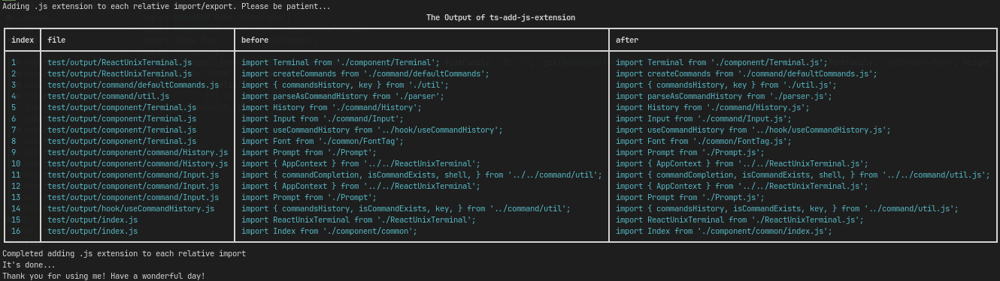

# **ts-add-js-extension**

Initially meant for TypeScript NodeJS projects only, however if you are lazy to add `.js` extension to your JavaScript relative import, you can also use this as well.

What it does is it add `.js` extension to each relative import and export for ES Module JavaScript, so you don't have to do it yourself

**Note**:
This package will automatically add `/index.js` for import/export statement as we can omit `index` at the end of import/export

#### In TypeScript / JavaScript file

```ts
import { add } from './math;
export { add, sub, mul, div } from './math;

import div from './math/div';
export * as div from './math/div';

console.log(add(2, 1));
```
#### will yield

```ts
import { add } from './math/index.js';
export { add, sub, mul, div } from './math/index.js';

import div from './math.div.js';
export * as div from './math/div.js';

console.log(add(2, 1));
```
### Need a sample output?


## **_Question_**

`Why do I build this?`

Initially I wrote it only for myself because I don't like to have `.js` in my TypeScript import statement if I were to compile my TypeScript project to ESNext Module, it just feels weird although it works. Another option is to compile it to CommonJS Module, but I don't want to. Besides, it's good to learn something new as this is done with the help of AST :). Thus I can use this package for my TypeScript or JavaScript projects

`How do I raise an issue?`

Feel free to raise an issue if you have a question, an enhancement, or a bug report.

## **_How to use_**

```sh
yarn add -D ts-add-js-extension
```

OR

```sh
npm i -D ts-add-js-extension
```

There are two arugments
| Argument | Usage | Type |
| :--- | :--- | :--- |
| dir | The folder that need to add .js extension | **Required** |
| include | The folder of files that is imported or included in `dir` folder, exclusing the `dir` specified | **Optional** |
| showchanges | Determine whether to show showchanges for changed files in table format. default to `true` | **Optional** |

### In package.json add:

Your compiled TypeScript folder or JavaScript folder can be named whatever you like, in this case the I will name it as dist

```json
{
    "scripts": {
        "build:ts-add-js-extension": "ts-add-js-extension add --dir=dist"
    }
}
```

If you need to include various root folder, for example, `common`, `dist`, `build`, you name it

```json
{
    "scripts": {
        "build:ts-add-js-extension": "ts-add-js-extension add --dir=dist --include=common dist build --showchanges=true"
    }
}
```
